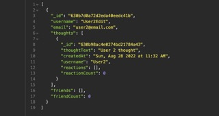

# Social-Network-API

## A social media site API back end connected to MongoDB via mongoose npm.

Walk through demo videos:

[User routes (including add and delete friends) and first part of thought routes](https://drive.google.com/file/d/1FnuIkFQh_85KhVpQ8BcnsmWC13FA6h_y/view?usp=sharing)

[End of thought routes, reaction routes, and user/thoughts delete](https://drive.google.com/file/d/1EF1T_pQvgr4V7gBgDxDx0Ri5LWNUY2rK/view?usp=sharing)

## Table of Contents:
- [Installation](#installation)
- [Usage](#usage)
- [Technologies](#technologies)
- [License](#license)
- [Contributing](#contributing)
- [Testing](#tests)
- [Questions](#questions)
## Installation 
Clone the repository from GitHub onto your machine in a local folder. This program will require Node.js and MongoDB. Install node.js: [Installation Guide](https://coding-boot-camp.github.io/full-stack/nodejs/how-to-install-nodejs). Install MongoDB: [Installation Information](https://www.mongodb.com/docs/manual/administration/install-community/). From the root of the project folder do an npm (Node Package Manager) install to get the package dependencies (type `npm install` on the command line). Dependencies used are: express.js, mongoose, and date-and-time. 
## Usage 
This is the back end only so you'll need to use Insomnia, Postman, or similar app. You can add, view, update, and delete users and thoughts. You can also add and delete friends for users and reactions to thoughts.

## Technologies
- Javascript
- [MongoDB](https://www.mongodb.com/)
- [Mongoose](https://mongoosejs.com/)
- [Express](https://expressjs.com/)

## License 
&copy; 2022 by Amy McCabe. 
This project is licensed under the MIT license.
https://opensource.org/licenses/MIT  
## Contributing 
Please submit a new issue or pull request. 
## Tests 
Same as usage.
## Questions 
Contact me at: [mcca0168@umn.edu](mailto:mcca0168@umn.edu) or [GitHub](https://github.com/McAmy2001/)
